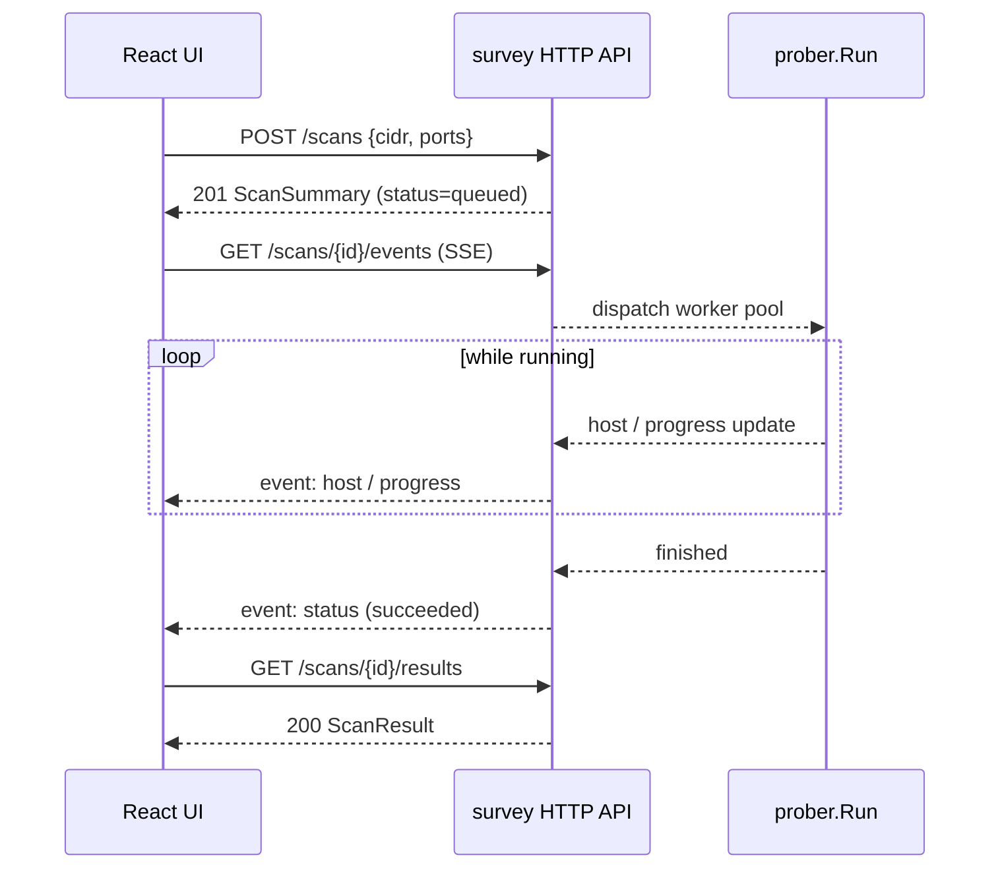

# mdns-survey 后端接口文档 (v1)

为前端 React 应用提供的 HTTP API 规范。文档基于现有 CLI 的数据模型
(`internal/model`) 与探测能力 (`internal/prober`) 设计，约定后端以
`net/http` + JSON 实现，并通过 Server-Sent Events (SSE) 推送扫描进度。

> 状态约定：本文档为 **接口契约 (contract-first)**；后端实现的提交节奏由
> 工程方排期决定，前端可先按本文档完成 UI 与类型定义。

---

## 1. 通用约定

### 1.1 Base URL

```
http://<host>:<port>/api/v1
```

开发期建议 `http://localhost:8080/api/v1`，由后端命令 `survey serve --addr :8080` 启动（待实现）。

### 1.2 内容协商

| Header | 值 | 说明 |
| --- | --- | --- |
| `Content-Type` | `application/json; charset=utf-8` | 请求体编码 |
| `Accept` | `application/json` 或 `text/event-stream` | SSE 端点必须用后者 |

### 1.3 鉴权

PoC 阶段无鉴权；生产部署建议：

- Header `Authorization: Bearer <jwt>`；
- 或同源 Cookie + CSRF Token。

后端实现前可在 React 端预留 `apiClient` 拦截器位置。

### 1.4 CORS

后端默认开启：

```
Access-Control-Allow-Origin: <frontend origin>
Access-Control-Allow-Methods: GET,POST,DELETE,OPTIONS
Access-Control-Allow-Headers: Content-Type,Authorization
Access-Control-Allow-Credentials: true
```

### 1.5 错误格式

所有非 2xx 响应均返回统一结构：

```json
{
  "error": {
    "code": "INVALID_CIDR",
    "message": "parse cidr \"foo\": ParsePrefix(\"foo\"): no '/'",
    "field": "cidr"
  },
  "request_id": "9d2c0b2e-f7e7-4c4f-9a3c-3b1f5a4f6d2e"
}
```

| HTTP | code 取值（示例） | 触发场景 |
| --- | --- | --- |
| 400 | `INVALID_CIDR`, `INVALID_PORT_RANGE`, `MISSING_FIELD` | 入参校验失败 |
| 404 | `SCAN_NOT_FOUND` | 任务 ID 不存在 |
| 409 | `SCAN_ALREADY_RUNNING` | 重复触发同一任务 |
| 422 | `CIDR_TOO_LARGE` | 超过 `MaxHosts` 上限 |
| 429 | `RATE_LIMITED` | 任务并发上限 |
| 500 | `INTERNAL` | 未分类错误 |

---

## 2. 数据模型

为方便 React 项目直接复制为 `src/types/api.ts`：

```ts
// ====== 通用 ======
export type UUID = string;
export type ISO8601 = string;          // e.g. "2026-05-12T06:34:00Z"
export type DurationStr = string;      // Go time.Duration, e.g. "800ms", "1.5s"

export interface ApiError {
  error: { code: string; message: string; field?: string };
  request_id: string;
}

// ====== 扫描任务 ======
export type ScanStatus =
  | "queued"
  | "running"
  | "succeeded"
  | "failed"
  | "canceled";

export interface ScanRequest {
  /** Mutually exclusive with ip_range. CIDR, e.g. "192.168.1.0/24". */
  cidr?: string;
  /** Mutually exclusive with cidr. e.g. "192.168.1.10-192.168.1.20" or "192.168.1.10-20". */
  ip_range?: string;
  /** Comma-separated. e.g. "5353,53,5000-5001". Defaults to "5353". */
  ports?: string;
  /** Go duration, default "800ms". */
  timeout?: DurationStr;
  /** Bounded worker pool, default 64. */
  workers?: number;
  /** Network interface (IPv6 link-local). Default "". */
  iface?: string;
  /** Extra PTR names (FQDN, with trailing dot). Default []. */
  extra_ptr_list?: string[];
  /** Default true; sends "_services._dns-sd._udp.local." meta query first. */
  enumerate?: boolean;
  /** Default false; also probe via TCP. */
  tcp?: boolean;
}

export interface ScanSummary {
  id: UUID;
  status: ScanStatus;
  request: ScanRequest;
  /** Total (IP, port, transport) tuples planned. */
  targets_total: number;
  /** Completed tuples (advances during streaming). */
  targets_done: number;
  hosts_with_results: number;
  created_at: ISO8601;
  started_at?: ISO8601;
  finished_at?: ISO8601;
  error?: ApiError["error"];
}

// ====== 扫描结果 (与 internal/model 1:1) ======
export interface Service {
  /** PTR FQDN, e.g. "_workstation._tcp.local." */
  type: string;
  /** Human label derived from type, e.g. "workstation". */
  short_name: string;
  /** "tcp" | "udp" | "". */
  transport: string;
  /** Target port from SRV; 0 when service has no SRV (e.g. _device-info). */
  port: number;
  /** Instance name. */
  name: string;
  /** SRV target FQDN (no trailing dot). */
  hostname: string;
  ipv4: string;
  ipv6: string;
  ttl: number;
  /** Raw TXT strings preserved in arrival order. */
  txt: string[];
}

export interface Host {
  /** "ip:port/transport" — also the result key. */
  source: string;
  ip: string;
  probe_port: number;
  services: Service[];
  /** PTR question names that produced answers (deduped). */
  ptrs: string[];
}

export interface ScanResult {
  scan: ScanSummary;
  hosts: Host[];
}
```

---

## 3. 端点

### 3.1 创建扫描任务

`POST /api/v1/scans`

请求体：`ScanRequest`

成功响应：`201 Created`

```json
{
  "id": "9d2c0b2e-f7e7-4c4f-9a3c-3b1f5a4f6d2e",
  "status": "queued",
  "request": {
    "cidr": "192.168.1.0/24",
    "ports": "5353",
    "timeout": "800ms",
    "workers": 64,
    "enumerate": true
  },
  "targets_total": 254,
  "targets_done": 0,
  "hosts_with_results": 0,
  "created_at": "2026-05-12T06:34:00Z"
}
```

校验规则：

- `cidr` 与 `ip_range` 二选一，缺失返回 `MISSING_FIELD`，同时存在返回 `INVALID_PARAM`。
- CIDR 展开数量 ≤ `MaxHosts` (1<<20)，否则 422 `CIDR_TOO_LARGE`。
- `ports` 范围内每个端口必须 ∈ `[1, 65535]`，否则 `INVALID_PORT_RANGE`。
- 并发数 `workers` ∈ `[1, 4096]`。

curl：

```bash
curl -sS -X POST http://localhost:8080/api/v1/scans \
  -H 'Content-Type: application/json' \
  -d '{"cidr":"192.168.1.0/24","ports":"5353","timeout":"800ms","workers":64}'
```

React (fetch)：

```ts
const res = await fetch(`${API}/scans`, {
  method: "POST",
  headers: { "Content-Type": "application/json" },
  body: JSON.stringify({ cidr: "192.168.1.0/24", ports: "5353" }),
});
const summary: ScanSummary = await res.json();
```

### 3.2 列出扫描任务

`GET /api/v1/scans?status=running&limit=20&cursor=<opaque>`

返回：

```json
{
  "items": [ /* ScanSummary[] */ ],
  "next_cursor": "eyJvZmZzZXQiOjIwfQ"
}
```

查询参数：

- `status` 可选，取 `ScanStatus` 枚举值；
- `limit` 默认 20，上限 100；
- `cursor` 用于分页（不透明字符串）。

### 3.3 查询单个任务摘要

`GET /api/v1/scans/{id}`

返回：`ScanSummary`。

不存在时 `404 SCAN_NOT_FOUND`。

### 3.4 查询任务结果

`GET /api/v1/scans/{id}/results`

返回：`ScanResult`（含完整 `hosts[]`）。

任务尚未结束时仍返回 200，`scan.status` 反映当前阶段，`hosts[]` 为
**已收到的** 部分结果，前端可据此实现"边扫边看"。

### 3.5 取消任务

`DELETE /api/v1/scans/{id}`

成功响应：`202 Accepted`，body：

```json
{ "id": "...", "status": "canceled" }
```

已 `succeeded`/`failed` 的任务返回 `409 SCAN_ALREADY_RUNNING`（实际是
已终止状态，前端按错误码引导用户刷新即可）。

### 3.6 进度流 (Server-Sent Events)

`GET /api/v1/scans/{id}/events`

要求 `Accept: text/event-stream`。后端按下列事件类型推送，事件 ID 单调递增：

| event | data 结构 |
| --- | --- |
| `progress` | `{ "targets_done": 42, "targets_total": 254 }` |
| `host` | `Host`（每出现一个含结果的新 host 推送一次） |
| `service` | `{ "source": "192.168.1.50:5353/udp", "service": Service }`（增量服务） |
| `status` | `ScanSummary`（状态切换：running → succeeded/failed/canceled） |
| `error` | `ApiError["error"]` |

连接保持 keepalive：服务器每 15s 发送一行 `: ping\n\n` 注释帧。客户端断线后
应当用 `EventSource` 的 `Last-Event-ID` 头自动续传。

React 示例：

```ts
const es = new EventSource(`${API}/scans/${id}/events`);
es.addEventListener("progress", (e) => {
  const p = JSON.parse(e.data);
  setProgress(p.targets_done / p.targets_total);
});
es.addEventListener("host", (e) => {
  const h: Host = JSON.parse(e.data);
  setHosts((prev) => upsertHost(prev, h));
});
es.addEventListener("status", (e) => {
  const s: ScanSummary = JSON.parse(e.data);
  if (s.status !== "running") es.close();
});
es.onerror = () => {/* 重连由浏览器自动处理 */};
```

### 3.7 默认 PTR 列表

`GET /api/v1/defaults/ptr-list`

返回：

```json
{ "ptr_list": ["_workstation._tcp.local.", "_http._tcp.local.", "..."] }
```

直接读取 `internal/config.DefaultPTRList`，便于前端在「自定义 PTR」弹窗
里把内置项展示为只读 chip。

### 3.8 健康检查

`GET /api/v1/health`

```json
{ "status": "ok", "version": "1.0.0", "uptime_seconds": 42 }
```

---

## 4. 时序图：典型扫描流程



---

## 5. React 集成清单

最小工作量上手步骤：

1. 复制第 2 节的 TypeScript 类型为 `src/types/api.ts`。
2. 用 `fetch` 或 `@tanstack/react-query` 封装 `apiClient`，统一处理：
   - JSON 序列化；
   - 4xx/5xx 转换为 `ApiError` 抛出；
   - 注入 `Authorization` Header（后续启用鉴权时填）。
3. 扫描详情页面使用 SSE（3.6 节）做实时刷新，扫描结束后再 `GET /results`
   做一次最终对账。
4. 错误展示统一用 `error.code` 做国际化键，`error.message` 仅在开发模式
   显示原始信息。

---

## 6. 与 CLI 行为的等价关系

下表说明 API 字段如何映射到 `survey` 命令行：

| API 字段 | CLI 等价 |
| --- | --- |
| `cidr` | `--cidr` |
| `ip_range` | `--ip-range` |
| `ports` | `--ports` |
| `timeout` | `--timeout` |
| `workers` | `--workers` |
| `iface` | `--iface` |
| `extra_ptr_list` | `--ptr-list <file>`（文件内容数组化） |
| `enumerate` | `--enumerate` |
| `tcp` | `--tcp` |

CLI 与 API 共享 `internal/config.Config` 与 `internal/prober.Prober`，
因此 **二者输出结果对同一输入完全一致**，渲染格式差异仅在表层
（CLI 文本 vs JSON）。

---

## 7. 待办与下一版

- [ ] HTTP server 实现 (`cmd/server/main.go`)
- [ ] OpenAPI 3.1 自动生成（基于本文档手工 + `swag` 注解）
- [ ] WebSocket 备选通道（部分代理不友好 SSE 时）
- [ ] 任务持久化（SQLite/BoltDB），支持重启恢复
- [ ] 鉴权与多租户隔离
